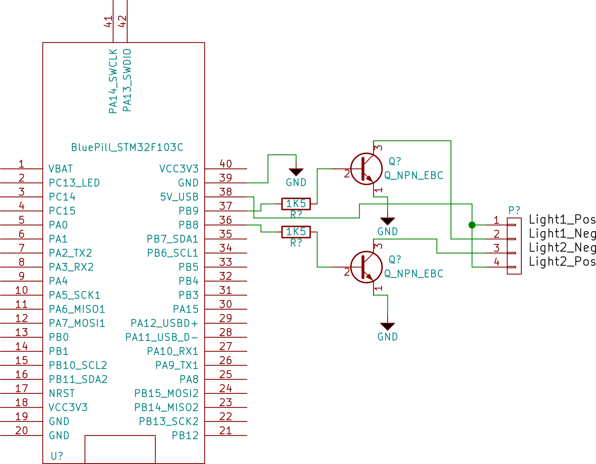

# Firmware for woot-light project.

This project is a simple automation of a pair of [Woot-Off lights](https://www.woot.com/offers/usb-powered-woot-off-lights)

Requires a Blue Pill STM32 board, a couple of 2n2222 BJTs, a couple of 1k5 resistors, wire, and a case.

The Blue Pill is powered by the USB and this provides enough power for the lights as well.

Use is simple, connect to the USB serial port, `?` displays build info and is useful to verify the serial connection.
`o mask time` is used to turn on one or both lights for a specified time.
`mask` is a bitmask of the lights. `1` is for light #1, `2` for light #2, `3` for both.
`time` is the time to activate the lights in milliseconds with a maximum of 1 minute.
